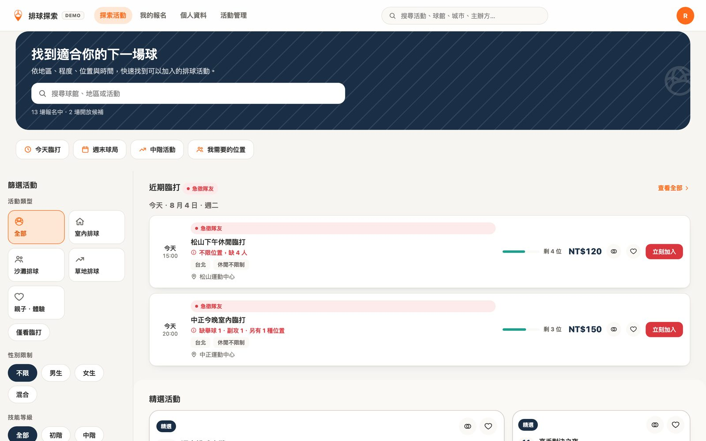

# Volleyball Hub

Live Demo: https://russell06-web.github.io/volleyball-hub/
Case Study: https://russell06-web.github.io/projects/volleyball-hub.html
Figma Prototype: https://www.figma.com/proto/MgsXCN04U1kAiGvaPLcjHg/Volleyball-Hub

> 更多細節：[產品決策說明](docs/PRODUCT_DECISIONS.md) · [技術限制詳細說明](docs/PRODUCT_LIMITATIONS.md) · [作品集案例筆記](docs/CASE_STUDY_NOTES.md)

## Overview

排球專項活動媒合平台的前端高擬真原型，涵蓋從探索場次、判斷是否適合自己、報名候補到主辦方管理的完整流程。目標使用者是想找排球活動的球友，以及想開團、招募隊友的主辦方——資料模型圍繞排球實際需求設計（球制、網高、場地材質、位置缺人狀況），而不是套用通用活動報名樣板。

## My Role

UI/UX Design、Information Architecture、User Flow、Front-End Development（React）、Component / Integration Testing（個人專案）

## Key UX Focus

- Progressive Disclosure：排球專項的進階篩選條件預設收合，避免一般使用者被過多欄位淹沒
- 硬性篩選邏輯：標示「不限」的活動不會被自動當成符合，避免誤導使用者
- 報名前重點資訊摘要，每一項標示「已明確／請確認／未提供」，而非要求使用者自行拼湊
- 資訊完整度提示只在真正影響判斷的欄位缺漏時出現，不做成扣分制的恐嚇式設計
- 無障礙的互動元件：所有彈出視窗具備 focus trap、Escape 關閉、背景捲動鎖定、焦點歸位

## Features

- 多關鍵字搜尋＋雙層篩選（基本條件常駐、排球專項條件收合），搜尋／篩選狀態同步網址列
- 活動詳情頁的位置缺人視覺化，並列出對應文字清單
- 個人／揪團報名、候補順位計算、快速加入（重用完整驗證邏輯，不繞過報名規則）
- 最多同時比較 3 場活動，行動裝置改為分頁式呈現
- 收藏、瀏覽歷史、已儲存的探索條件（最多 5 組）
- 主辦方 4 步驟建立活動精靈，含表單驗證與資訊完整度檢查

## Validation

核心商業邏輯（報名驗證、活動狀態判斷、位置缺人計算、篩選排序）抽成純函式並用 Vitest 完整測試；頁面層級的實際互動（搜尋流程、篩選視窗 focus 管理、Results Header 無障礙結構）用 React Testing Library + jsdom 撰寫元件與整合測試；並用 headless Chrome 在多個裝置寬度下檢查橫向捲動與 console error。沒有正式的使用者可用性測試。

## Limitations

純前端原型，沒有後端、資料庫或正式帳號系統——所有資料存在瀏覽器 localStorage，清除資料或換裝置就會消失。候補順位、活動計數等都是本地計算，並在畫面上明確寫出「不會發送名額通知或自動遞補」。刻意移除了付款方式管理、雙重驗證、真正的帳號刪除等尚未實作的入口，而不是用樣式假裝存在。詳細範圍見 [docs/PRODUCT_LIMITATIONS.md](docs/PRODUCT_LIMITATIONS.md)。

## Tech Stack

React 18、React Router、Vite、純 CSS（無 UI framework）、Vitest、@testing-library/react、localStorage、GitHub Pages（含 SPA fallback）

## Screenshots

